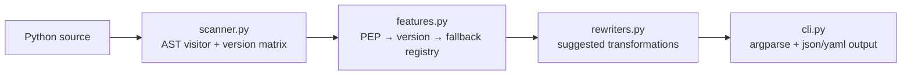

<div align="right">


[](LICENSE)

</div>

# py-compat-scan

**AST-based compatibility scanner for Python 3.12+ → 3.11/3.8 fallback detection.**

> Why should I care? You write modern Python (`type` aliases, `except*`, `match`), then it explodes on the 3.8 box you actually deploy to. py-compat-scan finds those constructs with pure static analysis — zero runtime execution, just the `ast` module — and suggests a fallback rewrite for each one, so you can gate it in CI before the old interpreter finds them for you.

**License:** [MIT](LICENSE) · **Security:** pure static analysis — it never executes the code it scans, so scanning untrusted code is safe by construction.

## What it will detect

| Feature | 3.12+ Syntax | Fallback | Severity |
|---------|-------------|----------|----------|
| `type` keyword (PEP 695) | `type Point[T] = tuple[T, T]` | `typing.TypeVar` + `typing.Generic` | 🔴 Hard |
| `except*` groups (PEP 654) | `except* ValueError:` | Nested `try/except` with group tracking | 🔴 Hard |
| `f-string` debug `=` (3.8) | `f"{x=}"` | `f"x={x}"` | 🟡 Soft |
| `match/case` (3.10) | `match obj:` | `if/elif` chain or `structural-pattern-matching` polyfill | 🟡 Soft |
| `tomllib` (3.11) | `import tomllib` | `import tomli; tomli.loads()` | 🟡 Soft |
| `typing.ParamSpec` (3.10) | `**P` | `typing_extensions.ParamSpec` | 🟡 Soft |
| `ast` unparse (3.9) | `ast.unparse(node)` | `astor` or manual codegen | 🟡 Soft |

## Target usage

```bash
# Scan a single file
py-compat-scan --target 3.8 src/my_module.py

# Scan a package recursively
py-compat-scan --target 3.11 --recursive ./src

# Output JSON for CI gates
py-compat-scan --target 3.8 --format json --fail-on hard ./src
```

```python
from py_compat_scan import Scanner

scanner = Scanner(target="3.8")
results = scanner.scan_path("./src")
for issue in results.hard_blocks:
    print(f"{issue.file}:{issue.line} → {issue.feature} requires {issue.min_version}")
```

CI gate shape:

```yaml
- uses: toxicwind/py-compat-scan@v1
  with:
    target: "3.8"
    fail-on: "hard"
    paths: "./src"
```

## Target architecture



## 🛠️ Status & roadmap

Scaffold stage: the package skeleton (`src/py_compat_scan/__init__.py`, v0.1.0) exists; `scanner.py`, `features.py`, `rewriters.py`, and `cli.py` are not yet implemented. The detection matrix above is the spec they will implement.

- [ ] AST visitor + version matrix (`scanner.py`)
- [ ] Feature registry: PEP → minimum version → fallback (`features.py`)
- [ ] Suggested rewrite engine (`rewriters.py`)
- [ ] CLI with `--target`, `--recursive`, `--format`, `--fail-on` (`cli.py`)
- [ ] Published package + GitHub Action (`toxicwind/py-compat-scan@v1`)

## 📄 License

MIT — see [LICENSE](LICENSE).
